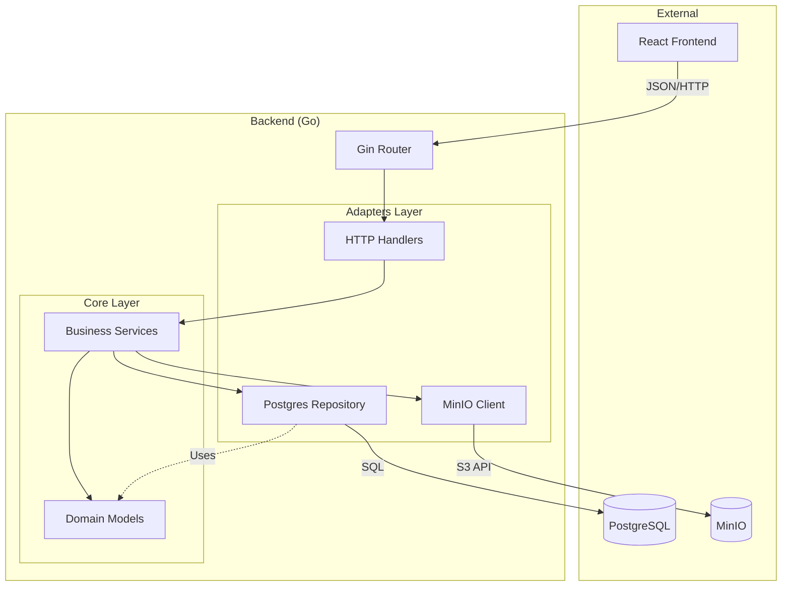
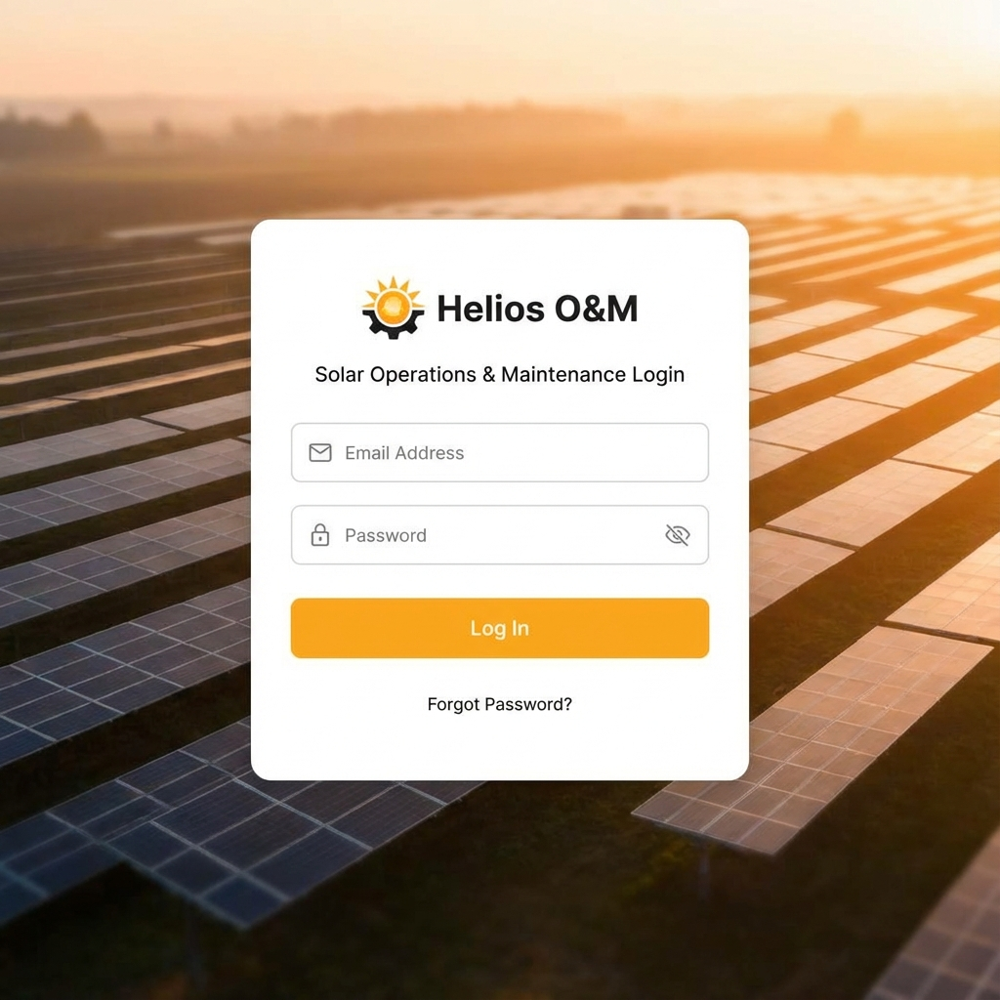
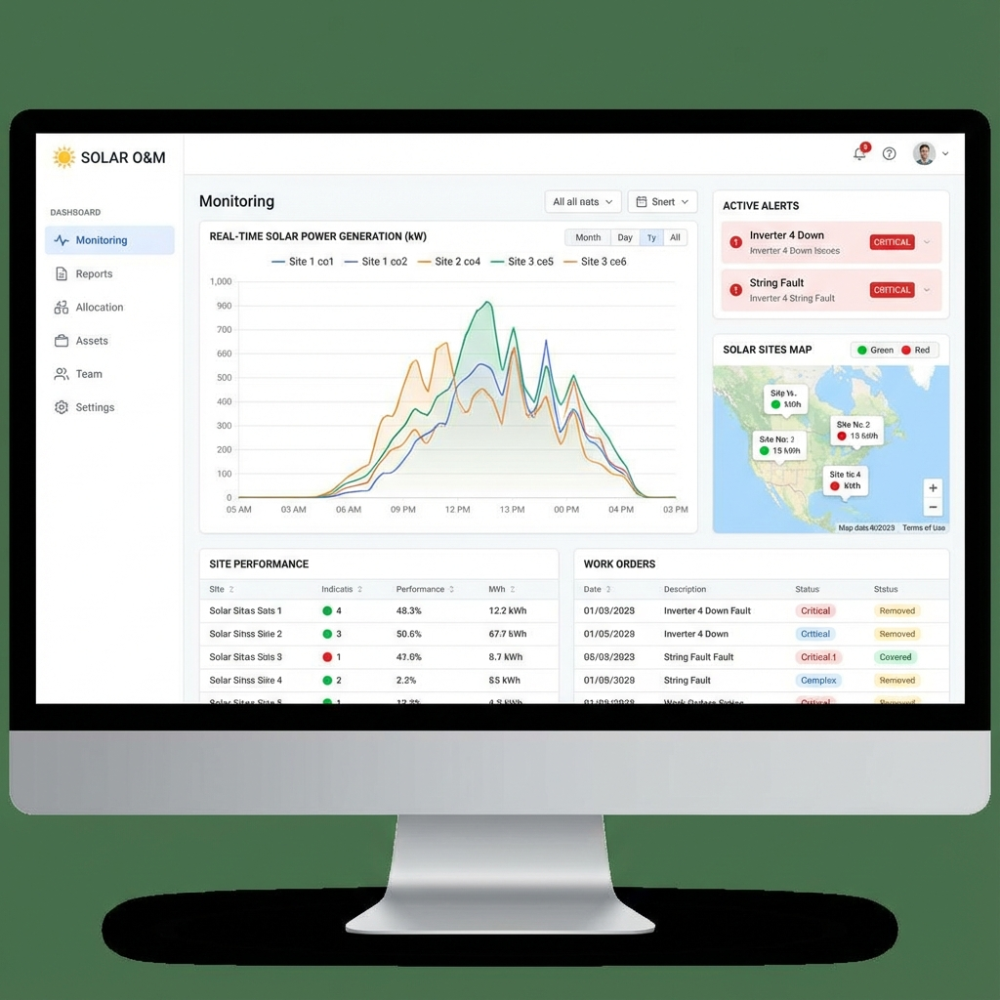

# Tóm tắt Dự án O&M (CMMS)

Tài liệu này cung cấp cái nhìn tổng quan chi tiết về kiến trúc và mã nguồn của dự án O&M (Operations & Maintenance), dựa trên việc phân tích cấu trúc thư mục và nội dung các file mã nguồn chính.

## 1. Tổng quan Công nghệ (Tech Stack)

### Backend
- **Ngôn ngữ**: Go (Golang).
- **Framework**: [Gin](https://gin-gonic.com/) (Web Framework).
- **Database**: PostgreSQL (sử dụng ORM [GORM](https://gorm.io/)).
- **Lưu trữ file**: MinIO (Object Storage).
- **Kiến trúc**: Hexagonal / Clean Architecture (Domain, Core, Adapters, Infrastructure).

### Frontend
- **Framework**: React 18 (sử dụng [Vite](https://vitejs.dev/) làm build tool).
- **Ngôn ngữ**: TypeScript.
- **Styling**: Tailwind CSS (kết hợp với `clsx` và `tailwind-merge`).
- **UI Components**: Headless UI, Heroicons, Lucide React.
- **Routing**: React Router DOM v6.
- **HTTP Client**: Axios.
- **Charts**: Recharts.
- **Animation**: Framer Motion.

---

## 2. Cấu trúc Backend (`backend/`)

Backend được tổ chức theo cấu trúc module hóa, tách biệt rõ ràng giữa logic nghiệp vụ và các lớp giao tiếp bên ngoài.

### Entry Point
- **`cmd/api/main.go`**: Điểm khởi chạy của ứng dụng.
    - Load biến môi trường (`.env`).
    - Kết nối Database và MinIO.
    - Thực hiện Migration database (AutoMigrate cho các bảng `Project`, `WorkOrder`, `Assign`, `User`, `Role`, v.v.).
    - Khởi tạo Repository, Service, Handler.
    - Đăng ký các route API (CORS, Auth, Users, Projects, Allocations, v.v.).

### Key Logic & Domain (`internal/`)
- **`internal/domain/`**: Định nghĩa các thực thể (Entities) và Interface của Repository.
    - **`project.go`**: Chứa struct `Project`, `ProjectCharacteristic` (thông số kỹ thuật: số lượng PV Module, Inverter...), `Assign` (phân công công việc), `MainCategory`, `ChildCategory`.
    - **`work_order.go`**: Định nghĩa phiếu công tác bảo trì.
    - **`auth.go`**: Định nghĩa User và Role (Admin, Manager, Engineer).

- **`internal/adapters/`**: Các adapter giao tiếp với bên ngoài.
    - **`http/handlers/`**: Xử lý HTTP request (Controller).
        - `work_order_handler.go`: API cho Work Orders.
        - `user_handler.go`, `auth_handler.go`: Quản lý người dùng và xác thực.
    - **`storage/postgres/`**: Triển khai các Repository tương tác với PostgreSQL.

- **`internal/core/services/`**: Chứa logic nghiệp vụ (Business Logic Layer).
    - `assignment_service.go`, `work_order_service.go`, `auth_service.go`.

### API Endpoints Chính
- **Auth**: `/api/auth/login`, `/api/auth/register`.
- **User**: `/api/users`, `/api/users/:id/role`.
- **Project**: CRUD `/api/projects`, quản lý đặc tính kỹ thuật `/api/projects/:id/characteristics`.
- **Classification**: Phân loại dự án (Solar Farm, Rooftop...).
- **Categories**: Cấu trúc cây hạng mục công việc `/api/main-categories` -> `/api/child-categories`.
- **Allocation (Assign)**:
    - `/api/allocations`: Phân công dự án cho nhân viên (Engineers).
    - `/api/allocations/user/:id`: Lấy danh sách công việc của một user.
    - Cơ chế đồng bộ số lượng thiết bị từ `ProjectCharacteristic` vào `Assign` data.

---

## 3. Cấu trúc Frontend (`frontend/`)

Frontend là một Single Page Application (SPA) xây dựng bằng React.

### Routing & Phân quyền (`src/App.tsx`)
Ứng dụng sử dụng `ProtectedRoute` để bảo vệ các trang dựa trên trạng thái đăng nhập. Hệ thống phân quyền chia thành 3 nhóm vai trò chính:

1.  **Admin Routes** (`/admin/*`):
    - Management: Quản lý người dùng, dự án.
    - Reports: Báo cáo tổng hợp.
    - Operations: Điều hành chung.

2.  **Manager Routes** (`/manager/*`):
    - Monitoring: Giám sát.
    - Allocation: Phân công công việc cho kỹ sư.
    - Reports: Báo cáo cấp quản lý.

3.  **User/Engineer Routes** (`/user/*`):
    - Environment: Môi trường làm việc cá nhân (trang chính để thực hiện công việc).
    - Statistics: Thống kê cá nhân.
    - Settings: Cài đặt tài khoản.

### Dịch vụ API (`src/services/api.ts`)
- Cấu hình Axios instance với `baseURL` trỏ đến server Backend.
- Định nghĩa các hàm helper để gọi API (ví dụ: `workOrderService.getAll`, `create`).

### UI/UX
- Giao diện hiện đại sử dụng **Tailwind CSS**.
- Tương tác mượt mà với **Framer Motion**.
- Hệ thống icon từ **Lucide React** và **Heroicons**.

---

## 4. Đặc điểm nổi bật của Hệ thống

1.  **Quản lý Tài sản Chi tiết**:
    - Hệ thống cho phép định nghĩa số lượng chi tiết cho từng loại thiết bị trong một dự án điện mặt trời (Inverter, DC Wire, Panels, v.v.) thông qua bảng `project_characteristics`.
    - Dữ liệu này tự động đồng bộ xuống các phiếu phân công (`Assign`) để kỹ sư biết khối lượng công việc chính xác.

2.  **Quy trình Phân công (Allocation Workflow)**:
    - Quản lý tạo dự án -> Cấu hình thông số (Characteristics) -> Phân công (Assign) cho kỹ sư.
    - Khi phân công, hệ thống tạo bản ghi `Assign` chứa snapshot dữ liệu công việc (`DataWork`) và kết quả thực hiện (`DataResult`).

3.  **Linh hoạt với Categories**:
    - Hệ thống danh mục công việc (Main/Child Categories) động, có thể thêm sửa xóa qua API, không fix cứng trong code, giúp dễ dàng mở rộng loại hình bảo trì.

4.  **Hạ tầng**:
    - Thiết kế sẵn sàng cho Docker (`docker-compose.yml`).
    - Hỗ trợ lưu trữ file/ảnh qua MinIO (S3 compatible), phù hợp cho việc upload ảnh báo cáo bảo trì tại hiện trường.

---

## 5. Mô hình Dữ liệu (Database Schema)

Dưới đây là sơ đồ thực thể mối quan hệ (ERD) được trích xuất từ các cấu trúc dữ liệu (`internal/domain/*.go`):

```mermaid
erDiagram
    PROJECT ||--|{ PROJECT_CHARACTERISTIC : "has specs"
    PROJECT ||--|{ ASSIGN : "is assigned in"
    PROJECT ||--o| PROJECT_CLASSIFICATION : "classified by"
    
    MAIN_CATEGORY ||--|{ CHILD_CATEGORY : "contains"
    
    USER ||--o| ROLE : "has role"
    USER ||--o| TEAM : "belongs to"
    USER ||--|{ ASSIGN : "performs"
    
    WORK_ORDER }|--|| USER : "requested by"
    WORK_ORDER }|--o| USER : "assigned to"
    WORK_ORDER }|--o| PROJECT : "at site"
    WORK_ORDER }|--o| PROJECT_CLASSIFICATION : "type"
    WORK_ORDER }|--o| MAIN_CATEGORY : "related to category"
    WORK_ORDER }|--o| CHILD_CATEGORY : "related to item"
    WORK_ORDER ||--|{ WORK_ORDER_ACTIVITY : "log history"

    PROJECT {
        uuid id PK
        string project_name
        string owner
        float area
        string location
    }

    PROJECT_CHARACTERISTIC {
        uuid id PK
        uuid project_id FK
        int pv_module
        int inverter
        int dc_wire
        int ac_wire
        int ..._others
    }

    ASSIGN {
        uuid id PK
        uuid user_id FK
        uuid project_id FK
        jsonb data_work "Snapshot of specs"
        jsonb data_result "Execution images/notes"
    }

    USER {
        uuid id PK
        string email
        string full_name
        uuid role_id FK
        uuid team_id FK
    }

    ROLE {
        uuid id PK
        string name "admin, manager, engineer"
    }

    WORK_ORDER {
        uint id PK
        string title
        string status "open, in_progress, completed"
        string priority
        uuid requester_id FK
        uuid assignee_id FK
    }
```

## 6. Kiến trúc Hệ thống (Backend)

Hệ thống tuân theo kiến trúc Clean/Hexagonal Architecture:
- Core: Domain & Services (Không phụ thuộc bên ngoài).
- Adapters: Http, Postgres, MinIO (Triển khai interfaces).



## 7. Giao diện (UI Images)

Dưới đây là hình ảnh minh họa cho các giao diện chính của hệ thống:

**Đăng nhập & Tổng quan**
Trong mô hình đề xuất, giao diện được thiết kế theo phong cách hiện đại, tối giản nhưng đầy đủ thông tin kỹ thuật:

> *Giao diện Đăng nhập (Mockup)*
> 

> *Giao diện Dashboard Quản lý (Mockup)*
> 


