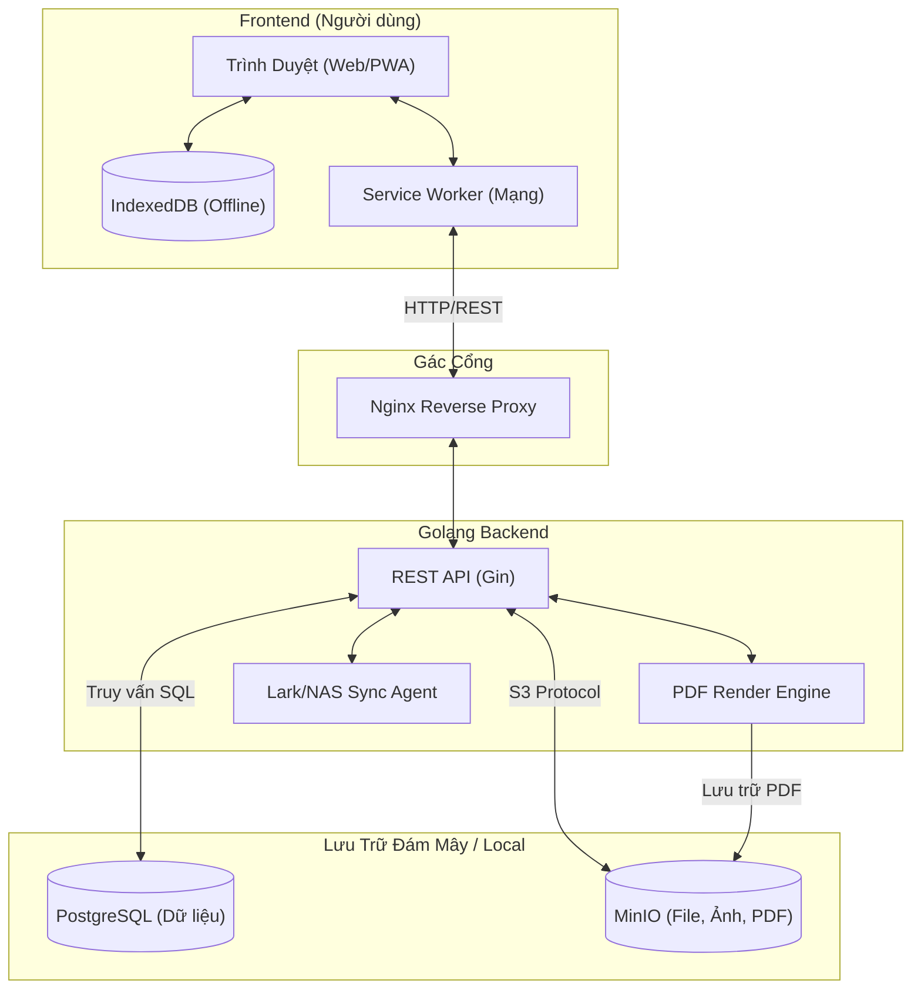
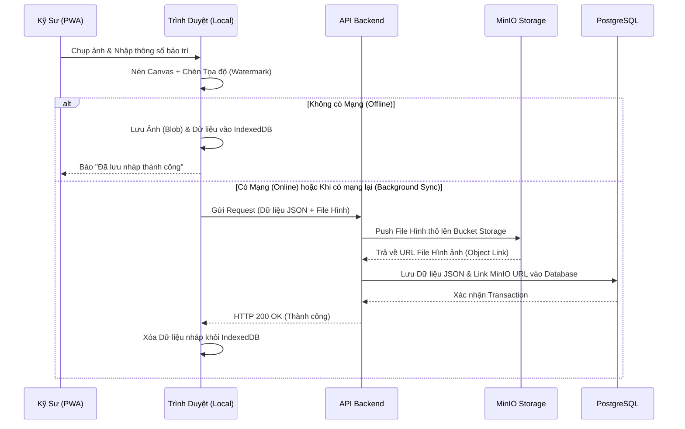
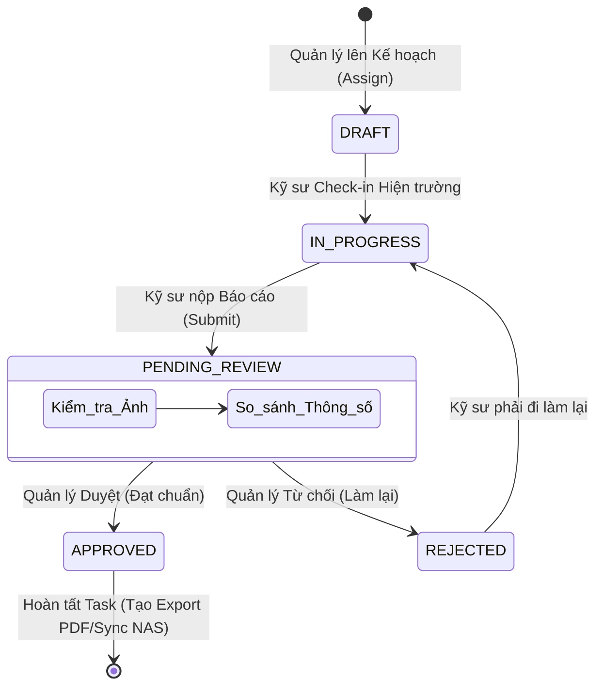

# Raitek O&M - Hệ Thống Quản Lý Vận Hành & Bảo Trì Điện Mặt Trời

*(Phiên bản Enterprise V6.3.2 | Cập nhật lần cuối: 2026)*

**Raitek O&M (Operations & Maintenance)** là nền tảng hệ thống phần mềm cấp doanh nghiệp (Enterprise-grade) chuyên biệt được thiết kế để số hóa toàn diện quy trình quản lý, giám sát và thực thi bảo trì cho các nhà máy điện năng lượng mặt trời. Hệ thống giải quyết triệt để các bài toán vận hành ngoài hiện trường (nơi sóng yếu hoặc không có mạng) thông qua kiến trúc Offline-First, đồng thời quản lý khối lượng dữ liệu khổng lồ bằng mô hình dữ liệu phân cấp phức hợp.

Tài liệu này là bản tổng hợp kỹ thuật và nghiệp vụ toàn diện nhất, đóng vai trò như một Cẩm nang Hệ thống (System Architecture Document) dành cho các Kỹ sư, Lập trình viên và Nhà Quản trị.

---

## 📖 Mục Lục
1. [Kiến Trúc & Công Nghệ Cốt Lõi (Tech Stack)](#1-kiến-trúc--công-nghệ-cốt-lõi-tech-stack)
2. [Sơ Đồ Khối & Quy Trình Nghiệp Vụ (Workflows)](#2-sơ-đồ-khối--quy-trình-nghiệp-vụ-workflows)
3. [Các Tính Năng Công Nghệ Cốt Lõi (Enterprise Features)](#3-các-tính-năng-công-nghệ-cốt-lõi-enterprise-features)
4. [Hướng Dẫn Build & Triển Khai (Deployment Guide)](#4-hướng-dẫn-build--triển-khai-deployment-guide)
5. [Cấu Trúc Thư Mục Hệ Thống](#5-cấu-trúc-thư-mục-hệ-thống)
6. [Bảng Mã Lỗi & Xử Lý Sự Cố (Troubleshooting)](#6-bảng-mã-lỗi--xử-lý-sự-cố-troubleshooting)

---

## 1. Kiến Trúc & Công Nghệ Cốt Lõi (Tech Stack)

Hệ thống được thiết kế theo tiêu chuẩn **Clean Architecture** và **Microservices-ready**, chia cắt rõ ràng giữa Frontend, Backend và Infrastructure.

### 1.1. Frontend (Mobile-First SPA & PWA)
- **Core Framework:** ReactJS 18 (Vite, TypeScript), kết hợp Tailwind CSS.
- **State Management:** Zustand (quản lý trạng thái), kết hợp React Query để caching.
- **Offline Capabilities:** Service Workers (PWA) bắt sự kiện mạng mạng, kết hợp `IndexedDB` lưu trữ tạm thời khối lượng lớn dữ liệu (Blob Ảnh, Báo cáo).
- **Native APIs:** Tích hợp sâu HTML5 Canvas (Nén ảnh tại Client) và Geolocation API (Định vị vệ tinh).

### 1.2. Backend (High-Performance RESTful API)
- **Core Framework:** Golang 1.22+ (Gin Web Framework), tối ưu hóa luồng I/O đồng thời bằng Goroutines.
- **Architecture:** Standard Go Layout (Cmd, Internal, Adapters, Core/Services, Domain).
- **Database ORM:** GORM.
- **Bảo mật:** Stateless Authentication bằng JWT Token ký chuẩn mã hóa HS256.
- **Background Tasks:** Robfig Cron scheduler xử lý các tác vụ đồng bộ NAS, Export PDF định kỳ.

### 1.3. Hệ Sinh Thái Lưu Trữ & Triển Khai (Infrastructure)
- **Cơ sở dữ liệu Quan hệ (RDBMS):** PostgreSQL 15 (Lưu trữ Structured Data, Task, Hierarchy).
- **Lưu trữ Đối tượng (Object Storage):** MinIO (S3-Compatible), chuyên dụng để streaming và lưu trữ hình ảnh hiện trường, file PDF báo cáo tốc độ cao.
- **Message Queue:** RabbitMQ (Xử lý hàng đợi tác vụ nặng nếu mở rộng microservices).
- **Đóng gói & Reverse Proxy:** Toàn bộ hệ thống chạy trên Docker Containers, Nginx đóng vai trò Load Balancer và API Gateway.

---

## 2. Sơ Đồ Khối & Quy Trình Nghiệp Vụ (Workflows)

Hệ thống xoay quanh 2 phân quyền chính: **Cấp Quản Lý** (Tạo job, phê duyệt, giám sát) và **Cấp Kỹ Sư** (Nhận job, thi công offline, thu thập dữ liệu).

### 2.1. Sơ Đồ Khối Tổng Thể Hệ Thống (System Architecture)



### 2.2. Quy Trình 1: Thu thập dữ liệu Hiện trường & Upload (Offline-First Pipeline)
Đây là trái tim của hệ thống, giúp kỹ sư lưu trữ dữ liệu tại các vùng lõm sóng (ví dụ: sa mạc năng lượng mặt trời).



### 2.3. Quy Trình 2: Phân bổ công việc & Phê duyệt (Allocation & Approval Flow)
Luồng kiểm soát chất lượng từ Cấp Quản lý xuống Kỹ sư thực thi.



---

## 3. Các Tính Năng Công Nghệ Cốt Lõi (Enterprise Features)

### 3.1. The Camera Anti-Fraud Engine (Hệ thống Camera Chống Gian Lận)
- **GPS Injection & Reverse Geocoding:** Ứng dụng gọi thẳng hệ thống vệ tinh, giải mã tọa độ thành địa chỉ đường thực tế và chèn 1 bản đồ Minimap vào góc phải của tấm ảnh (Watermark bất biến). Đảm bảo tính minh bạch tuyệt đối.
- **Horizon Leveling (Thước thủy Vector):** Áp dụng toán học chiếu Vector Trọng Lực (Gravity Projection), khóa cứng ảnh ở cạnh chuẩn (0°, 90°, 180°, 270°) theo đường chân trời. Tấm ảnh đóng dấu luôn ngay ngắn dù kỹ sư thao tác úp/ngửa điện thoại.
- **Canvas Compression (Nén nội suy Trình duyệt):** Tối ưu băng thông mạng. Một bức ảnh 7MB từ Camera 4K được nén xuống độ phân giải FullHD (1920px) chất lượng 80% chỉ còn ~300KB trước khi gửi qua mạng 3G/4G, mà vẫn đủ độ nét soi rõ vật tư.

### 3.2. SyncQueue & Garbage Collector (Offline-First Kháng Đứt Cáp)
- **The Race Condition Kill:** Thao tác "Nộp bài" được tách độc lập với việc "Upload file". Nếu kỹ sư bấm nộp khi xe đang đi vào vùng mất sóng, dữ liệu sẽ nằm ở `IndexedDB`.
- **Background Sync Machine:** Một cỗ máy chạy ngầm (Service Worker/Interval Queue) sẽ bắn `Active Ping` để kiểm tra Internet thật. Khi có kết nối, nó tuần tự đẩy các dòng ảnh nháp lên MinIO mà không cần kỹ sư phải thao tác lại.
- **Garbage Collector (GC):** Tự động dọn dẹp các bức ảnh nháp quá 7 ngày lưu trữ trong ROM Điện thoại hoặc các file tải lỗi quá 5 lần để giải phóng dung lượng rác cho thiết bị.

### 3.3. Standard Operating Procedures (SOP) & Guideline Portal
- Hiển thị tài liệu **Hướng dẫn vận hành chuẩn (SOP)** trực quan bằng Portal ngay trên giao diện thi công. Kỹ sư có thể mở Modal đè lên mọi Layer để vừa đọc sơ đồ kỹ thuật, vừa thực hiện thao tác bảo dưỡng tại trạm.

### 3.4. Kiến Trúc Dữ Liệu Phân Cấp (Hierarchical Data Model)
Quản lý thiết bị theo cây phả hệ độ sâu lớn: `Dự án` ➔ `Khu Vực` ➔ `Inverter` ➔ `Tấm Pin/Tủ điện`. Cấu trúc này giúp cô lập chính xác vị trí phát sinh lỗi của linh kiện trong cụm nhà máy hàng trăm hecta.

---

## 4. Hướng Dẫn Build & Triển Khai (Deployment Guide)

### 4.1. Đóng gói Offline Deploy (Air-Gapped Environment)
Dành cho việc cài đặt phần mềm lên Server cục bộ tại Nhà máy điện không có kết nối Internet ra ngoài.

**Bước 1: Đóng gói tại máy phát triển (Có Internet)**
Chạy đoạn mã sau trên PowerShell để kéo hạ tầng, build app và nén thành 1 gói duy nhất:
```powershell
docker pull postgres:15-alpine
docker pull minio/minio:latest
docker pull rabbitmq:3-management-alpine

docker build --no-cache -t raitek/om-frontend:latest ./frontend
docker build --no-cache -t raitek/om-backend:latest ./backend
docker build --no-cache -t raitek/om-sync-agent:latest ./deploy/sync-agent

# Gom toàn bộ Image thành file Tarball
docker save raitek/om-frontend:latest raitek/om-backend:latest raitek/om-sync-agent:latest postgres:15-alpine minio/minio:latest rabbitmq:3-management-alpine -o OM_Offline_Deployment/om_images.tar

# Nén toàn bộ cấu hình + Images mang đi triển khai
tar -czf OM_Offline_Package.tar.gz -C ./ OM_Offline_Deployment
```

**Bước 2: Triển khai tại Server Nhà Máy (Không Internet)**
Mang file `OM_Offline_Package.tar.gz` cắm USB vào Server Linux:
```bash
tar -xzf OM_Offline_Package.tar.gz
cd OM_Offline_Deployment

# Đập hộp toàn bộ Docker Images
docker load -i om_images.tar

# Cấu hình môi trường và khởi chạy
cp deployments/env.example deployments/.env
docker network create raitek_server || true
cd deployments
docker compose -f docker-compose.yml up -d
```

---

## 5. Cấu Trúc Thư Mục Hệ Thống

```text
OM/
├── backend/                       # Golang RESTful API (Port 4000)
│   ├── cmd/api/main.go          # Entry point
│   ├── internal/                # Clean Architecture Logic (Domain, Services, Repo)
│   └── migrations/              # Database Schema init
├── frontend/                      # React TypeScript SPA (Port 80)
│   ├── src/pages/               # Views (Manager, User, Dashboard)
│   ├── src/components/          # Tái sử dụng (CameraModal, SOP Guideline, Hierarchy)
│   └── src/services/offline/    # Lớp Database Browser (IndexedDB, Queue)
├── deploy/                        # Các Script và Agent hỗ trợ đồng bộ (Sync Agent)
└── OM_Offline_Deployment/         # Cấu trúc dành riêng cho triển khai Air-gapped
    ├── deployments/             # Chứa docker-compose.yml và biến môi trường
    └── auto_start.sh            # Script tự kích hoạt khi Server khởi động lại
```

---

## 6. Bảng Mã Lỗi & Xử Lý Sự Cố (Troubleshooting)

### 6.1. Mảng Frontend & Trình Duyệt

| Lỗi / Triệu Chứng | Nguyên Nhân | Cách Xử Lý |
| :--- | :--- | :--- |
| **Màn Hình Trắng (White Screen)** | Cache trình duyệt đang ngậm bản `index.html` cũ. | **Xóa Cache Trình Duyệt:**<br/>- **iOS Safari:** "Tải lại bỏ chặn nội dung" / Xóa lịch sử.<br/>- **Android Chrome:** Xóa "Cookie và Dữ liệu trang web". |
| **Màn Hình Camera Đen Thun** | Chưa cấp quyền API `getUserMedia` hoặc bị chặn bởi giao thức HTTP thường. | - Đảm bảo URL là HTTPS.<br/>- Nhấn ổ khóa trên URL ➔ Cài đặt trang ➔ **Cho phép (Allow)** Máy Ảnh và Vị Trí. |
| **Mất Bản đồ Watermark [---, ---]** | Module Geocoding lấy tọa độ thất bại (Thiết bị giới hạn quyền hoặc bị che chắn vệ tinh). | 1. Bật **Vị trí chính xác cao (Precise Location)** trong Settings điện thoại.<br/>2. Di chuyển khỏi mái che tôn/kính 5s để bắt sóng GPS. |

### 6.2. Mảng Backend & Hạ Tầng

| Mã Lỗi API | Logic Lỗi | Phương Pháp Giải Quyết |
| :--- | :--- | :--- |
| **HTTP 401** | *Sai Token JWT* | Token hết hạn. Dữ liệu nháp dưới app sẽ bị niêm phong an toàn. Kỹ sư cần ra chỗ có mạng để Đăng nhập lại là App tự đồng bộ. |
| **HTTP 403** | *Vượt Quyền (Forbidden)* | Kỹ sư cố gắng gọi API dành cho Trạm Trưởng. Bị chặn ở Middleware. |
| **HTTP 408** | *Timeout / Request Too Large* | Do đường truyền quá yếu. Cần kiểm tra lại `quality` Canvas (Nên < 0.8) để Payload nhỏ lại. |
| **SYNC_00** | *Fake Network Status* | Điện thoại bắt wifi không có Internet. Hệ thống sẽ tự đưa Queue vào trạng thái Sleep và Ping thăm dò lại sau 30 giây. |
| **DB_01** | *Full Quota IndexedDB* | Bộ nhớ máy Kỹ sư đã đầy. Tắt đa nhiệm trình duyệt và mở lại để hệ thống quét rác (Garbage Collector) dọn bớt ảnh đã đồng bộ thành công. |

---
*Bản quyền phân tích kiến trúc, giải pháp công nghệ và thiết kế luồng hệ thống thuộc về **Phạm Hoàng Phúc**.*
