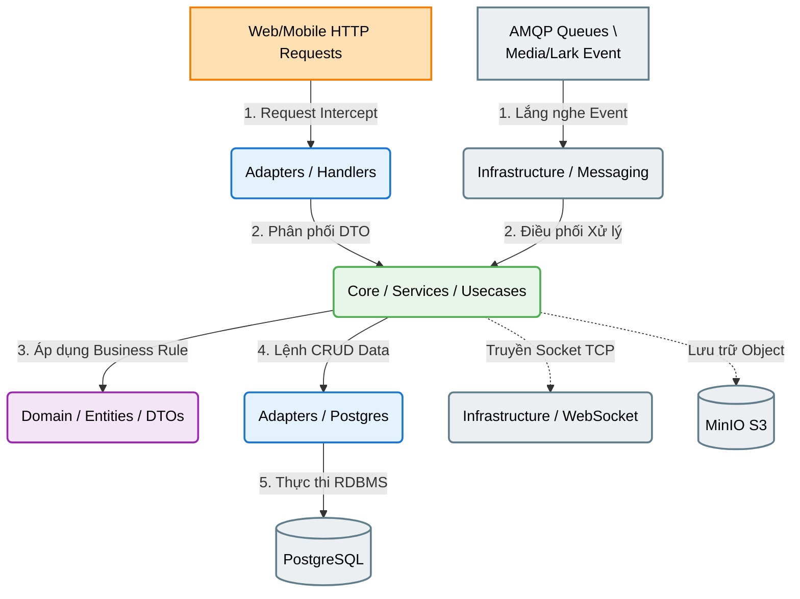

# Tài Liệu Phân Tích Kiến Trúc Backend Chuyên Sâu (Backend Architecture Expert Analysis)
**Dự án:** Hệ thống O&M Raitek (Operations & Maintenance)

Tài liệu này cung cấp đặc tả kỹ thuật chi tiết về kiến trúc máy chủ (Backend) của hệ thống Raitek, được phát triển trên ngôn ngữ Golang. Hệ thống tuân thủ nguyên lý thiết kế **Clean Architecture**, tối ưu hóa cho luồng xử lý sự kiện (Event-Driven) quy mô lớn, hướng đến việc làm cơ sở lý luận học thuật và bàn giao giải pháp công nghệ.

---

## 🌳 SƠ ĐỒ KIẾN TRÚC HỆ THỐNG (ARCHITECTURAL DIAGRAM)



---

## 🌳 TỔNG QUAN PHÂN TẦNG VẬT LÝ (DIRECTORY CẤU TRÚC)

Dưới đây là một mặt cắt cấu trúc thư mục, từ phần nền tảng (cmd) đến phần lõi kiến trúc (domain):

```text
backend/
├── cmd/
│   └── api/main.go            👉 [Entrypoint] Điểm khởi chạy của hệ thống: Đọc cấu hình kết nối, khởi tạo Dependency Injection (DI) và khởi chạy máy chủ cung cấp API.
├── configs/                   👉 Xử lý tải và kiểm định tính toàn vẹn của tệp cấu hình môi trường (.env, yaml).
├── migrations/                👉 Phiên bản hóa cơ sở dữ liệu (Database Schema Migrations), chứa kịch bản khởi tạo bảng (DDL).
│
└── internal/                  🌟 Tầng Định Nghĩa Hệ Thống (Clean Architecture Layers)
    │
    ├── adapters/              🚧 (TẦNG DAO ĐỘNG GIAO TIẾP - Presentation / Data Access)
    │   ├── http/handlers/     👉 [Controllers] Trực tiếp nhận và xử lý HTTP Request, xác thực đầu vào trước khi điều hướng tới tầng Core.
    │   └── storage/postgres/  👉 [Repositories] Tương tác độc quyền với cơ sở dữ liệu PostgreSQL thông qua Gorm hoặc SQL thuần túy.
    │
    ├── core/                  🧠 (TẦNG ĐIỀU BIÊN NGHIỆP VỤ - Application Use-Cases)
    │   └── services/          👉 [Business Logic] Chứa thuật toán và quy tắc nghiệp vụ hệ thống. Hoàn toàn độc lập khỏi giao thức đường truyền.
    │
    ├── domain/                🧬 (TẦNG THỰC THỂ CỐT LÕI - Enterprise Models)
    │   ├── model/             👉 Định nghĩa các thực thể tĩnh đại diện cho một Domain bất biến của doanh nghiệp.
    │   └── dtos/              👉 [Data Transfer Objects] Thể thức đóng gói dữ liệu giúp bảo toàn thực thể Core khi gửi ra môi trường ngoài.
    │
    └── infrastructure/        ⚙️ (TẦNG HẠ TẦNG KẾT NỐI - Edge Integrations)
        ├── messaging/         👉 Quản lý Message Brokers như AMQP (RabbitMQ) giúp cách ly các luồng quá tải (Task Queue).
        ├── storage/           👉 Cung cấp quyền truy xuất các hệ lưu trữ Object phi cấu trúc cục bộ như AWS S3 / MinIO.
        └── websocket/         👉 Kiểm soát kết nối Real-time TCP và phân luồng bản tin sự kiện trên diện rộng theo thời gian thực.
```

---

## 📌 Khái Quát Tiêu Chuẩn Kỹ Thuật (Technical Analysis Note)

Giải pháp Backend Golang đáp ứng 3 tiêu chí kỹ thuật quy mô lớn (Enterprise-scale):
1. **Dependency Inversion (Nguyên lý Đảo ngược Phụ thuộc):** Lớp `Core` hoàn toàn không chia sẻ độ kết dính (Coupling) với cơ sở dữ liệu (Database) hoặc Khung ứng dụng Web (Web Framework). Thay vào đó, sự giao tiếp giữa các tầng hình thành thông qua các Hợp đồng Interface, bảo đảm tính bền vững khi yêu cầu công nghệ thay đổi.
2. **Asynchronous Hand-off (Xử lý Đệm Bất đồng bộ):** Phương thức hàng đợi thông điệp (RabbitMQ & Background Goroutines) loại bỏ khả năng bão hòa bộ nhớ trung tâm do đột biến kết nối. Những tiến trình tải hệ đa phương tiện (Upload Blob Ảnh) được giao phó cho tiến trình ngầm tách rời.
3. **Decoupled Edge Notification:** Thay vì tốn kém tài nguyên vào Long-polling, mạng lưới sử dụng TCP Socket siêu nhẹ nhằm phát những xung báo hiệu ("Broadcast Trigger") với biên độ nội dung nhỏ, giúp hệ thống Frontend tải lệnh tĩnh an toàn, giảm độ trễ cực độ cho người vận hành.

---

## 📁 PHÂN TÍCH CHUYÊN SÂU CHỨC NĂNG TỪNG PHÂN HỆ (LAYER DEEP-DIVE ANALYSIS)

### 1. 📂 `cmd/` (Trung Tâm Khởi Tạo Hệ Thống - Bootstrap process)
> **Đặc tả vai trò:** Module chịu trách nhiệm quy nạp tài nguyên và khởi chạy Service.
- Quá trình bắt đầu bằng việc đọc cấu hình. Tiếp theo, hệ thống xây dựng mạng lưới Dependency Injection: tiến hành cung ứng `Repository` vào `Service`, và `Service` vào các `Handler`.
- Khởi chạy HTTP Web Server và các Worker Threads nền tảng mà không mang bất kỳ phép toán nghiệp vụ nội bộ nào.

### 2. 📂 `internal/adapters/handlers/` (Tầng Điểm Cuối Dịch Vụ - Delivery/Controllers)
> **Đặc tả vai trò:** Đây là lớp giao tuyến chịu áp lực chịu tải tiên phong hỗ trợ kết nối mạng dạng RESTful API.
- Lớp `handlers` phân rã dữ liệu từ Client Payload.
- Tiến hành tiến trình đối chiếu quy chuẩn (Data Validation). Nếu yêu cầu (Request) phù hợp, hệ thống thiết lập thành `Data Transfer Object (DTO)` cấp vào thư mục `Services`.
- Thu thập phản hồi để ánh xạ nó qua chuẩn HTTP Status Code (200 OK, 400 Bad Request) để báo hiệu cho máy trạm đầu cuối chuẩn xác.

### 3. 📂 `internal/adapters/storage/postgres/` (Tầng Xử Lý Cơ Sở Dữ Liệu - Data Access)
> **Đặc tả vai trò:** Đây là phạm vi triển khai những yêu cầu từ Data Interface cho nền tảng quản trị cơ sở dữ liệu (DBMS).
- Mọi tương tác giao tác (Transaction) hoặc SQL Query tới hệ cơ sở dữ liệu hiện tại (PostgreSQL) đều bị giới hạn quyền truy cập ở khối Adapter này.
- Kiến trúc đảm bảo việc phân vùng (Isolating) các module liên đới sẽ thuận lợi nếu dự án đổi mới công nghệ lưu trữ.

### 4. 📂 `internal/core/services/` (Tầng Quy Luật Nghiệp Vụ - Business Logic Layer)
> **Đặc tả vai trò:** Trọng tâm kiến trúc quản lý chức năng và quy tắc luân lý nghiệp vụ ứng dụng.
- Khối `Service` tiếp nhận và chi phối tín hiệu dữ kiện. Lớp này làm việc hoàn toàn không có định kiến với môi trường: Nó không tồn tại khái niệm Web Socket hay HTTP Protocol. 
- Tại đây phát sinh những logic cao độ (ví dụ như `allocation_workflow_service.go`), điều khiển thuật toán Phê duyệt đơn giao tuyến tính, gọi đồng bộ tới hệ đa sinh thái Lark Bitable, hoặc ra lệnh cho CSDL lưu đối tượng.

### 5. 📂 `internal/domain/` (Cấu Trúc Thực Thể Chóp Đỉnh - Core Entities)
> **Đặc tả vai trò:** Lớp bao bọc khái niệm phần mềm tĩnh ở mức cao cấp nhất. Cấu trúc tuyệt đối độc lập khỏi framework thứ ba.
- Chứa đựng các khai báo `Entities` chuẩn hóa đại diện cho hệ sinh thái hiện thực (Ví dụ Struct `TaskAllocation`, `User`).
- Cung cấp mạng lưới hợp đồng giao thức `Interfaces` quy định khống chế những phương thức mà `Repository` của cơ sở dữ liệu sẽ phải đảm nhiệm, giúp tạo ra một kiến trúc vững chãi tuân thủ nguyên lý Open/Closed.

### 6. 📂 `internal/infrastructure/` (Tầng Giao Diện Thích Ứng Bên Cạnh - Infrastructure Layer)
> **Đặc tả vai trò:** Nền tảng chuyên biệt phụ trách những tác vụ giao tiếp phần cứng nội bộ máy chủ, thư viện nền, hay API Môi trường liên kết thứ Ba ngoài tầm kiểm soát của mã nguồn lõi.
- **`messaging`:** Mảng duy trì hàng đợi tiến trình bất đồng bộ (AMQP RabbitMQ) điều hướng dồn những luồng báo cáo hệ thống nặng tránh sự cạnh tranh xử lý từ Main Thread.
- **`storage`:** Vòi nối duy trì giao dịch tệp đa phương tiện tới Không gian Bộ nhớ Đám mây Không Cấu trúc S3 (MinIO Object Storage).
- **`websocket`:** Trạm kiểm soát băng thông duy trì các thiết chế Realtime TCP nhằm phát những thông tin Push Event đồng cập nhật xuống đa dạng điểm đầu cuối thiết bị mạng.

### 7. 📂 `middlewares/` (Hệ Sinh Thái Điều Phối Tín Hiệu Cuối - Interceptors)
> **Đặc tả vai trò:** Lớp bảo an đứng đón toàn bộ Request tiền xử lý trước khi các cấu hình đạt tới cấu hình Routing REST.
- Nổi bật với tính năng kiểm duyệt an ninh kỹ thuật số Token (Authentication JWT).
- Thẩm định phân vùng tiếp nhập vai hành vi (Authorization - Cảnh báo 403 Forbidden). 
- Kìm hãm rủi ro do lưu lượng tăng cường cục bộ (Rate Limiting) cũng như kiểm soát an toàn bảo mật HTTP (CORS, Request Tracing).

