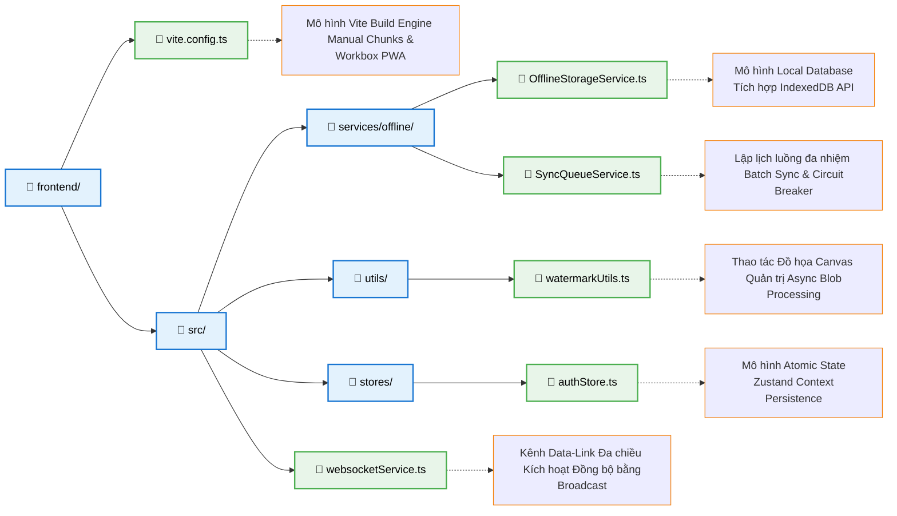

# Tài Liệu Phân Tích Kiến Trúc Frontend Chuyên Sâu (Frontend Architecture Expert Analysis)
**Dự án:** Hệ thống O&M Raitek (Operations & Maintenance)

Tài liệu này cung cấp các đặc tả kỹ thuật chi tiết về kiến trúc ứng dụng trạm đầu cuối (Frontend Client) của hệ thống Raitek. Lược đồ kiến trúc tập trung vào ba trọng tâm công nghệ: Hệ thống Phân tán Ngoại tuyến (Distributed Offline-First System), Xử lý Luồng Đa nhiệm (Concurrency Processing), và Giao diện tương tác Phần cứng (Native Interface). Giải pháp công nghệ trong tài liệu này hoàn toàn có thể được dùng làm mẫu tham chiếu chuẩn trong môi trường Đồ án Tốt nghiệp.

---

## 🌳 MÔ HÌNH TOÁN ĐỒ KIẾN TRÚC (ARCHITECTURAL DIAGRAM)

*(Ghi chú: Sơ đồ luồng tiến trình được biểu diễn dưới định dạng Mermaid)*



---

## 🌳 TỔNG QUAN CẤU TRÚC PHÂN TẦNG VẬT LÝ (DIRECTORY STRUCTURE)

Dưới đây là một mặt cắt dọc (Slice) để hệ thống hóa kiến trúc thư mục chuẩn:

```text
frontend/
├── tailwind.config.js         👉 [Design System Tokenizer] Từ điển xác lập các hằng số màu sắc, Gradient, và hiệu ứng của thành phần giao diện toàn cục.
├── vite.config.ts             👉 [Build Engine Configuration] Tối ưu hóa quá trình tạo điểm (Bundling) thông qua `Manual Chunks` nhằm cô lập mã nền (Core Library Lib) và mã ứng dụng (Vendor Code). Kích hoạt thành phần Workbox phục vụ việc sinh tự động tệp Service Worker phục vụ ứng dụng dạng PWA.
├── capacitor.config.ts        👉 [Native Bridge Interface] Cấu hình giao thức kênh liên kết song phương Inter-Process Communication (IPC) cho phép truy cập quyền Hệ sinh thái nguyên bản (Camera Device, Geolocation API).
│
└── src/
    ├── services/              🌟 (NETWORK & SYNC LAYER - TẦNG ĐIỀU PHỐI MẠNG LƯỚI)
    │   │
    │   ├── offline/           
    │   │   ├── OfflineStorageService.ts 👉 Áp dụng chuẩn IndexedDB API phục vụ khả năng lưu giữ phi trạng thái (Data Persistence). Lưu tệp đa phương tiện (Raw Blob) và thông tin siêu cấu trúc (Metadata) cục bộ máy người dùng, phòng tránh rủi ro sập tiến trình ngột.
    │   │   └── SyncQueueService.ts      👉 Hàng chờ tích hợp (Background Event Loop) hoạt động phân tán. Thực thi giới hạn Concurrent Request để giảm rủi ro tấn công DDoSing về máy chủ trung tâm.
    │   │
    │   ├── websocketService.ts          👉 Áp dụng chuẩn kết nối WSS 2 chiều đa truyền tải, nhận các xung thông báo (Pointers) với dung lượng thấp nhắn nhủ cho phía Client yêu cầu cập nhật lại Dữ liệu qua chuẩn REST API truyền thống.
    │   │
    │   └── api/                         👉 Xây dựng mô hình REST Client theo mô típ Axios Interceptors, hỗ trợ kỹ thuật cài Authorization Header (Bearer JWT) ẩn.
    │
    ├── stores/                🧠 (STATE MANAGEMENT LAYER - TẦNG QUẢN LÝ TRẠNG THÁI HIỆN THỰC)
    │   │
    │   ├── authStore.ts       👉 Tối ưu hóa hiệu năng render qua kiến trúc Atomic (Zustand) thay vì mô hình Context Waterfall truyền thống, hỗ trợ đồng bộ vĩnh cửu (Persist State) với môi trường cục bộ lưu phiên Đăng Nhập.
    │   └── uiStore.ts         👉 Quản lý Global Layout Context (View Layout, Trạng thái đóng mở Menu Sidebar).
    │
    ├── utils/                 ⚙️ (EDGE COMPUTING & ALGORITHMS - TẦNG XỬ LÝ TOÁN HỌC TRẠM BIÊN)
    │   │
    │   └── watermarkUtils.ts  👉 Modules xử lý đồ họa tính toán chuyên sâu (Client-Side Rendering): Gán nhãn tọa độ Vệ tinh lên cấu trúc mảng Pixel. Cách ly chu trình thao tác Blob phi song song với Main-thread nhằm đảm bảo tỷ lệ FPS khung hình ổn định cho thiết bị có hiệu năng thấp.
    │
    ├── components/            🧱 (PRESENTATION COMPONENT LAYER - TẦNG TỔNG HỢP LINH KIỆN HIỂN THỊ)
    └── pages/                 📺 (BUSINESS VIEW LAYER - TẦNG TRANG CHỨC NĂNG NGHIỆP VỤ)
```

---

## 📌 Khái Quát Tiêu Chuẩn Kỹ Thuật (Technical Standard Note)

Đánh giá theo góc nhìn lý luận kiến trúc phần mềm, hệ thống Frontend đáp ứng xuất sắc 3 đặc tả cốt lõi cho một nền tảng quy mô nghiệp vụ xí nghiệp:
1. **Network Partition Resilient (Tính đàn hồi kháng lỗi Mạng):** Hệ thống được cấu trúc để duy trì trạng thái hoạt động ngay vùng khuất điểm sống trạm mạng (Offline-First) do đã cấu hình công nghệ NoSQL phân mảnh qua *IndexedDB* thành trạm lưu trữ phân tán độc lập.
2. **Task Atomization (Nguyên tử hóa tác vụ nền):** Tách biệt và phân khối các tác vụ có yêu cầu vi xử lý (CPU) lớn ra môi trường Asynchrony (Phương thức lưu .toBlob không đồng bộ), kết hợp mô hình Queue Worker ngầm tải ảnh độc lập với phiên hiển thị đồ hoạ UI.
3. **Optimized Update Delta (Tối Ưu Hóa Delta Giao Truyền):** Lưu lượng băng thông liên lạc được tinh giảm cao cấp nhờ mô hình kết nối lai (Hybrid Socket-HTTP): Áp dụng phương thức TCP Websocket mỏng nhẹ nhằm chỉ truyền đi những khung xung nhịp mang tính hiệu lệnh (Trigger Event), thúc đẩy HTTP Caching phân luồng riêng nạp lại nội dung chỉ khi đã thay đổi.

---

## 📁 PHÂN TÍCH CHUYÊN SÂU CHỨC NĂNG TỪNG PHÂN HỆ (DIRECTORY DEEP-DIVE ANALYSIS)

Sơ lược chi tiết kiến trúc phân bổ nhiệm vụ xử lý (Task Distribution Life-cycle) theo chức năng định hướng tại thư mục lõi `src/`:

### 1. `assets/` (Quản Lý Tài Nguyên Tĩnh Môi Trường Bậc Thấp - Static Resources)
> **Đặc tả vai trò:** Đây là thư viện quản trị những yếu tố tĩnh vật lý không nằm trong nhóm thay đổi biên dịch theo thời gian thực (Ví dụ: Hình ảnh, phông chữ, SVG). Môi trường Vite Rollup sẽ đóng gói nhóm tài nguyên này với một dải băm thông tin (Hash Key). Quá trình đó hỗ trợ cho thuật toán Service Worker dễ dàng tạo thiết chế cấu hình bộ nhớ Caching (Caching Strategies) vô thời hạn đối với trình duyệt cuối.

### 2. `components/` (Nhà Máy Cung Ứng Linh Kiện Giao Diện - Reusable Component Pipeline)
> **Đặc tả vai trò:** Lưu trú các thành tố kiến trúc mức độ đơn lẻ hoặc tổ hợp được thiết lập với khả năng tái sử dụng độc lập đa hệ màn hình.
- **Tính chuẩn mực lý thuyết (Dumb Component Pattern):** Một component độc lập hoàn hảo không duy trì State qua việc giao tiếp mạng, mà chỉ dựa trên nguồn thông số `props` tham chiếu từ tuyến cha cung ứng, nâng cao tối đa độ tin cậy Module test.

### 3. `constants/` (Sổ Định Danh Khai Báo Biến Thể Hằng - System Constants)
> **Đặc tả vai trò:** Hệ thống hóa và duy trì một nguồn tham chiếu đồng nhất (Single Source of Truth) đối với tổ hợp những biến số ít mang hiện tượng biến đổi, ví dụ: Đường dẫn REST URI cấp trung tâm, quy định vòng lặp tương tác (Rules Timeout), chuẩn quy định màu hệ thống (Status Color Constants). Phòng trừ hành vi mã hóa tĩnh rải rác đan chéo tệp tin thiếu khoa học.

### 4. `stores/` & `contexts/` (Trạm Quản Lý Tín Hiệu Định Đỉnh Toàn Cục - Global State System)
> **Đặc tả vai trò:** Kiểm soát các nguồn dữ liệu thay đổi linh hoạt tác động lên nhiều phân vùng chức năng độc lập mã không cần phải chịu tải nguyên từ hiệu ứng Prop Drilling (truyền tham số cấu trúc đa tầng).
- **`stores/`:** Hoạt động dựa trên tư duy Atomic Pattern của thư viện Zustand. Đảm bảo nguồn dữ liệu yêu cầu quy trình đồng gói trạng thái kéo dài (State Persisting) lên phân vùng Cookie/Local Storage của trình duyệt như Mật mã Định Danh (Access Token) và Gốc Tọa Độ (Geolocation Data Matrix).

### 5. `hooks/` (Phân Khối Hàm Cấp React Đóng Gói Riêng Biệt - Custom React Hooks)
> **Đặc tả vai trò:** Trích xuất các luồng tính toán liên quan đến vòng đời của hệ React (Component Lifecycles) ra thành những mảng hàm độc lập đơn lẻ để gọi theo phương thức tập trung.
- Tái sử dụng việc thiết lập đường mòn UI và phần cứng thay vì lặp mã tái hồi. Cụ thể như tệp `useDeviceLocation.ts` tạo ra giao tiếp Bridge nối với Native Hardware Sensor thu nạp kinh tuyến/vĩ tuyến của thiết bị nền tải đi động.

### 6. `layouts/` (Lớp Khung Định Vị Bề Mặt Giao Diện Lõm - View Wrappers)
> **Đặc tả vai trò:** Đóng gói cấu trúc hộp bảo vệ ngoại quan của Ứng dụng (Application Layout Container). `MainLayout.tsx` thiết đặt khung mẫu cho những thành phần tĩnh vững chãi như Thanh định tuyến động (Navbar) tĩnh, Thanh phân mục (Sidebar) bảo toàn không bị tái khởi động (mất State) khi có sự chuyển giao màn hình.

### 7. `pages/` (Phân Diện Màn Hình Chỉ Định Nghiệp Vụ - End-User Business Views)
> **Đặc tả vai trò:** Đối tượng định tuyến trực diện cho địa chỉ Router mang quy định nghiệp vụ vận hành thực.
- Tại tầng lớp này, thuật toán điều phối luồng trung tâm hội tụ toàn bộ sức mạnh giữa Components, Stores và Services. Đóng gói hàm giao tiếp Network API (Fetch Call Request), nạp tính toán xử lí đầu ra tương ứng lên các khối cấu trúc tĩnh phía dưới.

### 8. `services/` (Tầng Giao Diện Gỡ Ràng Buộc Cơ Sở Mạng Lưới - Network Infrastructure Interfacing)
> **Đặc tả vai trò:** Phân tách vùng thông điệp trừu tượng của thiết kế DOM React khỏi tiến trình liên đới môi trường ngoại tuyến thứ Ba (APIs Integrations).
- Cấu hình quản trị thư viện phân giải `Axios` thiết lập hệ thống ghim Header tĩnh, quy chuẩn truy vấn máy chủ HTTP, song song tác vụ chạy nền qua luồng IndexedDB và đồng bộ hóa môi trường truyền nhận chuỗi WebSocket TCP.

### 9. `utils/` (Hệ Sinh Thái Nhiệm Thuật Toán Hỗ Trợ Độc Lập - Pure Helper Functions)
> **Đặc tả vai trò:** Đóng kín các tác vụ điều vận thuật toán mức độ đơn nguyên, thể hiện chuẩn như Các Hàm Chức Năng Cốt Lõi (Pure Functions). Hàm tiêu biểu: thiết kế thuật toán vẽ ma trận đồ họa Pixel `Canvas` quy mô lớn xử lý trực tiếp tiến trình Bitmap mà không đẩy CPU vào nút thắt xử lý mảng quá tải.

### 10. `types/` (Khế Ước Giao Thức Lập Trình TypeScript - Interface Definition Contracts)
> **Đặc tả vai trò:** Căn cứ lập pháp quy chuẩn hóa các đối tượng luồng thông qua phương thức mô tả kiểu Type. Việc yêu cầu sử dụng khai báo Type tĩnh giúp tháo gỡ sai sót phát sinh trên dữ liệu JSON định danh của Golang Endpoint. Giảm trừ triệt để tình huống gặp đứt gãy đối tượng Object Undefined khi bước vào trạng thái ứng dụng thương mại cấp bách (Runtime Errors).
