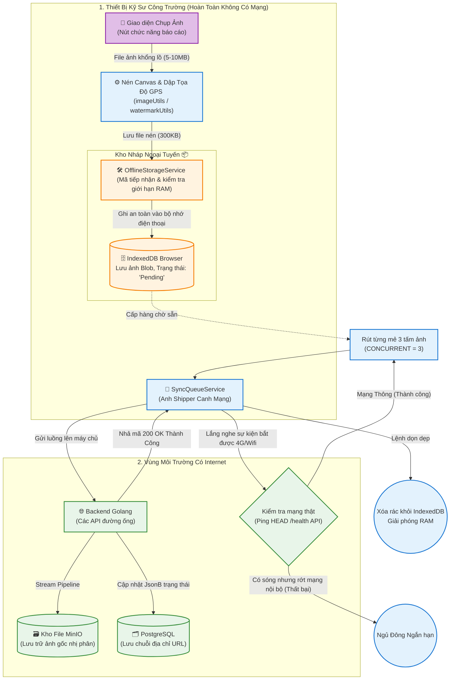

# Tài Liệu Hướng Dẫn & Phân Tích Frontend Raitek O&M (SOP Dành Cho Người Mới)

**Mục đích:** Tài liệu này được biên soạn để giải thích cách thức hoạt động của Frontend hệ thống Raitek O&M (Operations & Maintenance) một cách dễ hiểu nhất. Dù bạn là thực tập sinh mới vào, hay nhân viên không chuyên về IT, bạn đều có thể hiểu hệ thống đang làm gì đằng sau giao diện màn hình.

---

## 1. Hệ thống này là gì và tại sao lại được thiết kế như vậy?

Hãy tưởng tượng bạn là một kỹ sư đang đứng giữa trạm điện năng lượng mặt trời rộng hàng nghìn héc-ta. Chỗ bạn đứng **không có sóng 4G**, cũng **không có wifi**. Yêu cầu công việc là bạn gắn bó với thiết bị thông minh, chụp hình các hạng mục hư hỏng, ghi chú lại và nộp báo cáo cho cấp quản lý. 

Vậy làm sao ứng dụng web chạy được khi mất mạng?

Đó là lý do Frontend hệ thống Raitek OM được xây dựng theo chuẩn **PWA (Progressive Web App)** kết hợp tính năng **Offline-First** (Ưu tiên ngoại tuyến lên hàng đầu). 
Nói một cách dân dã:
- Mở web lên lần đầu bằng mạng thông qua trình duyệt (Chrome, Safari,...).
- Web tự động tải (download) hết tính năng cốt lõi của nó vào bộ nhớ đệm của điện thoại.
- Kể từ đó, bạn có thể rút cáp internet, ngắt 4G hay ra công trường múa không cần mạng. Giao diện vẫn hiện thị bình thường, mọi chức năng biểu mẫu, chụp ảnh đều hoạt động như đang có internet.

---

## 2. Công nghệ lõi được sử dụng (Góc nhìn Kỹ thuật cơ bản)
Mặc dù bạn không cần biết code, nhưng hãy lướt qua tên các công cụ:
- **Ngôn ngữ & Bộ khung:** ReactJS kết hợp Vite để chạy mượt mà siêu tốc độ.
- **Quản lý dữ liệu trung tâm (State):** Zustand.
- **Giao diện:** TailwindCSS.
- **Lưu trữ Offline:** IndexedDB (Một ổ cứng kho dữ liệu chuẩn được tích hợp ngầm bên trong trình duyệt của thiết bị di động).
- **Phần cứng thiết bị Native:** Capacitor (Dùng để giao tiếp xin quyền mở Camera thật của điện thoại, và quét tọa độ định vị GPS mà không bị trình duyệt ngăn cấm).

---

## 3. Quy trình nộp ảnh khi "mất mạng" (Phép màu của IndexedDB)
*(Mã nguồn kỹ sư cần lưu ý: `src/services/offline/OfflineStorageService.ts`)*

Khi bạn nhấn nút "Chụp Ảnh" ở công trường, ứng dụng không gửi tín hiệu để cầu cứu mạng internet. Hệ thống hoạt động theo 3 bước vững chắc:
1. **Chụp là cất:** Ảnh vừa được chụp sẽ được định dạng lại thành chuỗi dữ liệu mềm và cất thẳng vào kho lưu trữ nội bộ **IndexedDB** của trình duyệt web điện thoại.
2. **Quản lý giới hạn:** Khối dữ liệu này đủ thông minh để cảnh báo, hoặc chặn không cho bạn lưu nếu điện thoại của bạn đầy thẻ nhớ dung lượng. 
3. **Tuyệt đối an toàn:** Dù lúc đó điện thoại chuẩn bị hết pin sập nguồn, hay thao tác lỡ tay tắt app, xóa đa nhiệm... thì lúc mở nguồn lên lại, dữ liệu ảnh của bạn vẫn nằm nguyên vẹn đó chờ được báo cáo đi.

---

## 4. Cơ chế Đồng bộ ngầm (Về nhà nhận Wifi là ảnh tự bay lên)
*(Mã nguồn kỹ sư cần lưu ý: `src/services/offline/SyncQueueService.ts`)*

Hãy xem thành phần `SyncQueueService` này giống hệt một nhân viên **"Giao Vận Cần Mẫn"** luôn đứng chờ.
- **Shipper canh chừng mạng:** Nhờ bắt tín hiệu sự kiện hệ điều hành báo cáo, hệ thống liên tục quan sát 24/24. Khi điện thoại kết nối lại Wifi ổn định hoặc có sóng 4G khoẻ, nhân viên này sẽ thức dậy.
- **Tiêu chuẩn "Ping thử mạng":** Đôi khi điện thoại báo kết nối wifi nhưng wifi đó "rớt gói internet" (như wifi nội bộ trạm điện). Anh giao hàng sẽ phóng một mũi tên giả (Ping Request) vào thẳng trung tâm máy chủ ở Tổng Hành Dinh (Backend). Khi nghe thấy tiếng vọng xác nhận có mạng thật, ảnh mới bắt đầu được bốc xếp mang đi.
- **Tuyển mỗi lượt 3 đơn:** Để tránh làm tắc nghẽn lưu thông băng thông (gây sập Server) và tránh chai RAM điện thoại làm người dùng đơ cảm ứng, ảnh không bao giờ được đẩy ngộp lên cùng một lúc hàng chục tấm, thay vào đó máy chỉ bóp lượng nhỏ **3 tấm / lượt** tải. Tải xong mẻ này đi mẻ kế.
- **Điều gì xảy ra nếu token đăng nhập bị vô hiệu?** 
  Nếu kỹ sư đứng ở bãi trong thời gian quá lâu làm phiên bản đăng nhập chết đi giữa chừng (phiên gửi trả về HTTP 401 Unauthorized), Shipper sẽ khóa ngay lập tức và đình công, không quăng dữ liệu bừa bãi. Nó ép giữ trạng thái an toàn trên máy người dùng cho đến khi đăng nhập hợp lệ trở lại.

**Sơ đồ luồng cơ chế Đồng Bộ & IndexedDB:**

---

## 5. Xử lý ma thuật lên ảnh: Nén dung lượng và Đóng dấu bản quyền (Watermarking)
*(Mã nguồn kỹ sư cần lưu ý: `src/utils/watermarkUtils.ts` và `src/utils/imageUtils.ts`)*

Thiết bị di động của kỹ sư hay có độ phân giải camera ảo tưởng, trung bình dung lượng gốc cực lớn khoảng 5MB - 10MB/tấm. 
- Hành vi này ép nghẽn tốc độ đường dây 4G.
- Chiếm trọn không gian ổ cứng Cloud tốn kém hàng tháng của công ty.
- Và công nhân có khuynh hướng qua mặt: Tức tải hình một vật thể khác chụp ở nhà thay vì trực tiếp đang ở trạm điện.

**3 Biện Pháp Giải Quyết Không Thoả Hiệp:**
- **Nén bằng Canvas (Dòng Vẽ):** Mã nguồn lật một bản thảo vẽ ảo ngay trong điện thoại (HTML5 Canvas). Lấy dữ liệu ảnh và vẽ lại bức tranh với quy cách phân giải chỉ bằng 1/15 lần so với bản gôc. Dung lượng tụt dốc từ hàng Megabytes gãy đôi về chỉ còn khoản `~200KB - 300KB/ảnh`.
- **Đóng Dấu Không Thể Xoá Mờ (Watermark):** 
1. Hệ thống xin phép lấy được Tọa Độ (GPS) bất chấp cả khi không có mạng qua vệ tinh ăng-ten.
2. Vẽ Toạ Độ Kèm Thông Số Kỹ Thuật (Thời Gian chính xác cực chi tiết, Họ & Tên Công Nhân nộp, ID Thiết bị trạm).
3. Phủ toàn bộ lớp mực số liệu điện tử đó lên làm thành 1 khối vững chắc chìm sâu vào bức ảnh. Nó chứng minh ngay tức khắc vật chứng đó đang đứng đúng vị trí nhà máy thiết bị đó, tại giờ đó. Chống giả mạo gần như tuyệt đối (Audit Log).

---

## 6. Góc nhìn của Ban Lãnh Đạo (Bảng Điều Khiển Real-Time) qua cơ chế WebSocket
*(Mã nguồn kỹ sư cần lưu ý: `src/services/websocketService.ts`)*

Ở một nơi nào đó phòng lạnh trụ sở, Tivi LCD lớn có thể treo xuyên suốt một trang quản lý hoạt động vận hành trạm.
**Hệ thống tương tác như thế nào lên trung tâm?**
- Khi kỹ sư ở dưới công trường chốt bấm nút "Hoàn Thành/Nộp" (Lúc này đường đồng bộ ngầm đã gửi và phê duyệt hình ảnh đi thành công).
- Không cần sếp phải chạy đến chuột bấm máy lại, server ném một tín hiệu xuyên thấu cực nhanh (đường ống tên WebSocket) đập thẳng đến màn trình duyệt.
- Những ô dữ liệu hiện trên bảng, khung thống kê công việc ngày tự động nhấp nháy, lật mặt từ màu vàng, đỏ sang xanh lá cây mượt mà. 

---

> [!TIP]
> **Tuyệt Đỉnh Kiến Trúc:** Hệ thống Frontend Raitek OM không đơn thuần là thứ màn hình nhấn nút thông thuờng theo tiêu chuẩn thẩm mỹ. Nó là "Bộ giáp sinh tồn ngoại tuyến" cho nhân viên chịu đựng môi trường hoang tàn sóng viễn thông. Điểm cốt tử mà mọi Kỹ Sư Công Nghệ tiếp xúc dự án này nên nhớ là tôn trọng chữ **Offline-First**. Tuyệt đối không viết thêm những thay đổi hay chặn màn hình tải tốn mạng internet che đi quá trình hoạt động ngoài trời. Hãy bảo toàn lưu lượng và sức chịu tải của ứng dụng!
