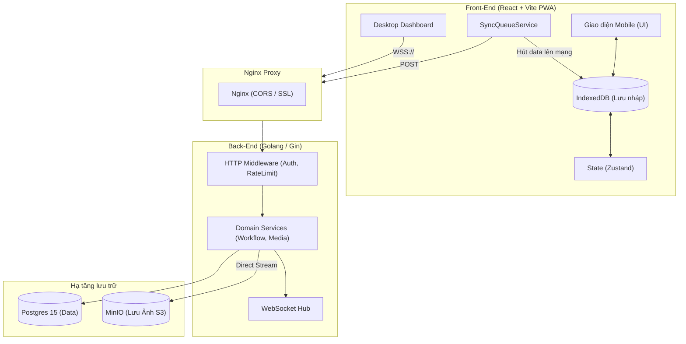
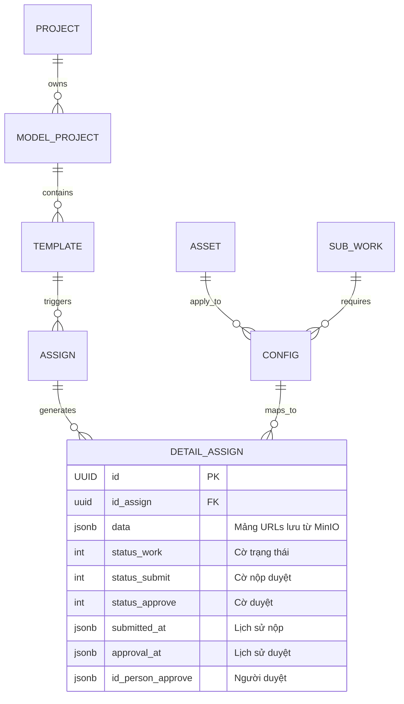
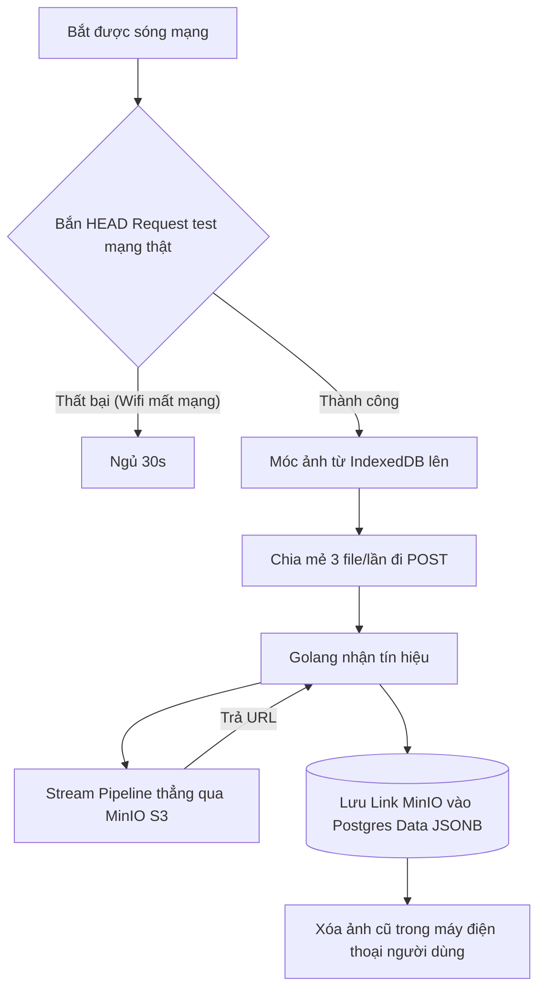
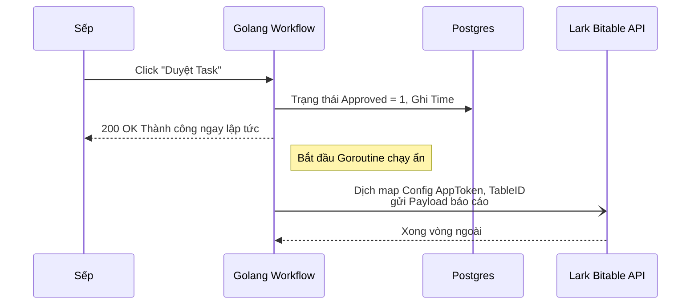

# TÀI LIỆU KỸ THUẬT VÀ KIẾN TRÚC HỆ THỐNG RAITEK O&M
**Người viết: Phạm Hoàng Phúc**

Bài viết này tôi ghi lại toàn bộ hệ thống kiến trúc, cấu trúc luồng dữ liệu và những giải pháp kỹ thuật cốt lõi trong quá trình tôi phát triển hệ thống Raitek O&M (Operations & Maintenance), phiên bản V6.3.2. Tài liệu này sẽ đóng vai trò như một cẩm nang handover để các bạn dev sau hoặc team vận hành nắm được logic cốt lõi.

---

## 1. Lời mở đầu & Định hướng kiến trúc 

Khi bắt tay vào làm OM, bài toán lớn nhất tôi phải đối mặt là môi trường sử dụng thực tế: **Công trường điện mặt trời hoang vu.**
- Anh em kỹ sư ngoài hiện trường đa số làm việc ở nơi không có mạng (hoặc bị nhiễu do thiết bị điện). 
- Cuối ngày có mạng lại, hàng trăm người đồng loạt bấm thiết bị gửi vài Gigabyte ảnh về server, rất dễ dẫn đến sập nghẽn.
- Vấn đề gian lận: Tải ảnh cũ từ hôm qua hoặc khai báo sai vị trí.

Để giải quyết, tôi quyết định chia hệ thống thành các khối vi dịch vụ (đóng gói qua Docker) và áp dụng **Clean Architecture** trên Backend. Điểm mấu chốt là biến ứng dụng web thành PWA (Progressive Web App) có khả năng offline 100%.



---

## 2. Tổ chức Cơ sở dữ liệu & Entity

Tôi dùng GORM kết hợp Postgres 15. Dưới đây là lược đồ ER cho luồng **Allocation** (Phân bổ công việc) - tính năng nặng nhất của dự án. Tôi phân rã từ `Project -> Config -> Assign -> DetailAssign`.



**Tại sao tôi dùng JSONB để lưu Audit Trail?**
Ban đầu tôi định tạo một bảng `ApprovalHistory` riêng. Nhưng nghĩ lại, với lượng task khổng lồ mỗi ngày, bảng History sẽ nhanh chóng phình lên hàng triệu dòng và làm chậm các query Join.
Vì thế, tôi chuyển sang tận dụng cột `JSONB` của Postgres. Mỗi lần sếp bấm duyệt, thay vì `INSERT` vào bảng mới, tôi chỉ việc móc cái mảng thời gian cũ ra, `append` thêm mốc thời gian/người duyệt mới cắm vào rồi ghi đè lên ngay ở row hiện tại. Lúc fetch ra Frontend, JSON trả về mảng thẳng tuột, React của tôi chỉ việc `.map()` ra là xong giao diện timeline lịch sử, rất nhàn cho DB.

---

## 3. Khắc phục việc mất mạng: IndexedDB & Nén Canvas

### 3.1. Chụp hình và đưa vào ROM (IndexedDB)
Ở các form web truyền thống, khi công nhân bấm chọn tệp mà rớt mạng thì submit sẽ chết đứng. 
Cách của tôi là: chặn luôn vụ upload trực tiếp. Vừa chụp xong, Frontend sẽ băm tấm ảnh thành mảng `Blob` nhị phân, rồi tống thẳng vào **IndexedDB** của trình duyệt. Dù anh em kỹ sư có tắt Chrome, sập nguồn điện thoại, ảnh vẫn nằm an toàn trong bộ nhớ máy.

### 3.2. Cắt giảm dung lượng với HTML5 Canvas
Một bức ảnh từ cam điện thoại giờ toàn 5MB - 8MB. Nếu ném nguyên file này lên 4G thì cạn băng thông. 
Tôi viết thêm 1 lớp giải nén nội suy: Nhúng cái ảnh vào 1 thẻ `<canvas>` ẩn, resize kích thước về quy chuẩn max 1920px (FullHD), sau đó đẩy định dạng `.jpeg` ở mức `quality 0.7`.
Kết quả ngon hơn mong đợi: File 7MB tụt xuống chỉ còn loanh quanh 300KB mở ra đọc biển số hay thông số kĩ thuật vẫn rất nét.

### 3.3. Định vị và chống góc nghiêng
Chắc mấy bạn cũng hiểu cảnh đứng thang đu dây chụp ảnh nó chéo cỡ nào. Để bức ảnh phẳng phiu, tôi code can thiệp vào `DeviceOrientationEvent`. Lúc người dùng giơ máy lên, bộ cảm biến vector trọng trường sẽ đo góc nghiêng trục vật lý thiết bị mình so với đường chân trời là bao nhiêu. Cuối cùng, tôi pass lại giá trị `-degree` vô cái canvas để bù trừ góc. Xong xuôi, đính thêm luôn toạ độ định vị GPS chèn vô góc tấm ảnh trước khi khóa nén (Watermarking). Khỏi sợ khai khống.

---

## 4. Background Sync & Xử lý nghẽn bộ nhớ Backend

Khi người dùng ẵm điện thoại chạy vô vùng có mạng Wifi/4G. Thằng Worker ngầm (`SyncQueueService.ts`) bắt đầu chạy.
Nó không gửi 1 phát cả chục ảnh lên, mà chia cắt theo lô `CONCURRENT_UPLOADS = 3`. 

Về phía Golang Backend, nếu tôi dùng hàm đọc file thông thường kiểu `ioutil.ReadAll()` thì toi ngay. Mỗi người đẩy lên 5MB, 1.000 người là mất đứt 5GB RAM Server để đệm.
Vì thế, ở nhánh `AllocationMediaService.go`, tôi code cho API đóng vai trò như cái ống nước (Pipeline). Khách đưa lên byte nào qua `io.Reader`, tôi stream thẳng qua MinIO theo byte đó bằng `UploadStream()`. Backend không tốn RAM đệm gì cả. Cực êm. Máy chủ nhỏ vẫn sống khoẻ re.



---

## 5. Cập nhật Real-time và "Tích hợp ngoại bang" (Lark)

Hệ thống quản trị OM tôi build không thể thiếu màn hình lớn cho cấp sếp coi.

### 5.1. WebSocket Operations Board
Tôi tích hợp cơ chế Hub WebSockets. Trong `AllocationWorkflowService.go`, mỗi lần 1 công việc được "Duyệt" hoặc "Hủy", hàm API cuối cùng sẽ nhả ` broadcastEvent()`.
Tất cả các màn hình Data Grid của admin đang treo ở công ty tự nhận bản tin `{"event":"task_updated"}`, tự trigger request kéo data mới về. Bạn không cần bám nút F5, các ô lưới màu Vàng/Xanh/Đỏ trên màng tự động đổi màu.

### 5.2. Chơi với Open API của Lark
Đây là module xuất báo cáo tự động sang chi nhánh khác.
Tôi có 1 trick nhỏ ở đoạn này: Lúc quản lý nhấn nút "Approve" (Duyệt). Nếu để Server đợi request gọi qua hệ thống API của Lark (Tencent) thì khá lâu, có khi mất 2-3s. Để UI không bị đơ, tôi đẩy tiến trình đó vô Goroutines nền `go s.postApproveAsync()`. API RESTful nảy trả liền HTTP 200 cho frontend chạy mượt, việc nhồi data lên Bitable Lark nhường cho chạy ẩn ngầm tới khi xong thì thôi.



---

## 6. Setup Bảo mật & Giới hạn chịu đựng

Bảo vệ API thì tôi chia làm mấy lớp ở thư mục `middleware/`:
- **Quản lý Token (Auth):** Xác thực bằng JWT. Có điểm lạ ở đây: Nếu Frontend báo Auth chết (`HTTP 401`) do Token hết hạn lúc công nhân đang giữa rừng. Tôi bắt lỗi 401 đó trên React, ép thằng `SyncQueue` ngủ đông lập tức, block mọi thao tác gửi gắm lên Server. Bảo vệ triệt để rủi ro lỗi HTTP làm văng mất file rác trên máy công nhân. Lúc họ cắm điện đăng nhập lại là dữ liệu tiếp tục đẩy thong thả.
- **Rate Limit Token Bucket:** Để chống hội chứng nhấn đúp (hoặc cắm bot test), tôi nhét thuật toán cái Xô (Token Bucket) vào IP Routing. Cứ mỗi IP chỉ chứa tối đa 20 request/s. Xả điên cuồng là ra HTTP 429 tạm cấm vận liền, nhỏ giọt châm lại từ từ qua thời gian hằng giây.

---

## 7. Đóng Block đem đi Deploy (Air-Gapped Flow)

Vì tính chất bảo mật cục bộ của các trạm điện mặt trời lớn, mạng nội bộ của họ không kéo cáp internet ra ngoài, chỉ có mạng LAN nhà máy chằng chịt. Bạn không thể Remote SSH vào Server `wget` hay `npm install` được.
Cách tôi dùng là gom mọi thứ về 1 cục file `tar`.

Tạo môi trường ở văn phòng trước bằng lệnh `docker save`:
```powershell
docker save raitek/om-frontend:latest raitek/om-backend:latest postgres:15-alpine minio/minio:latest -o om_images.tar
```
Chép cục `tar` vài trăm MegaBytes ấy vô cái USB. Lên lầu nhét USB vô máy chủ trạm, chạy lệnh `docker load -i om_images.tar`. Cóp file `.env` config duy nhất, gắn đúng mật khẩu DB nội bộ, rồi nhấn `docker-compose up -d`. Tự tay nó kéo Docker Internal Network móc DB với Backend lại với nhau. Quá trình set up 10s là có mặt trên máy chủ mới, hoàn toàn không cần 1 gói mạng ngoài.

---
**Tóm lại:** Toàn bộ sườn kiến trúc trên là kinh nghiệm thực chiến đúc kết lại của tôi, áp dụng đủ các trick về quản trị Network Timeout, Non-blocking I/O và PWA Offline-First để build ra một sản phẩm chịu nhiệt tốt nhất cho một ngành đặc thù ngoài trời. Các bạn support sau cứ bám thep luồng luân chuyển này để đọc source cho mượt nhé! Mọi tinh túy đều nằm ở đó.
